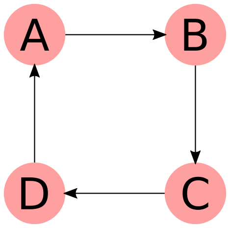
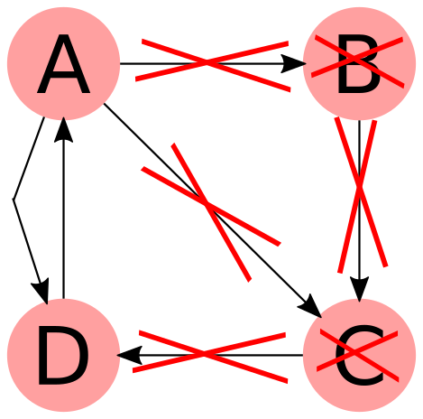
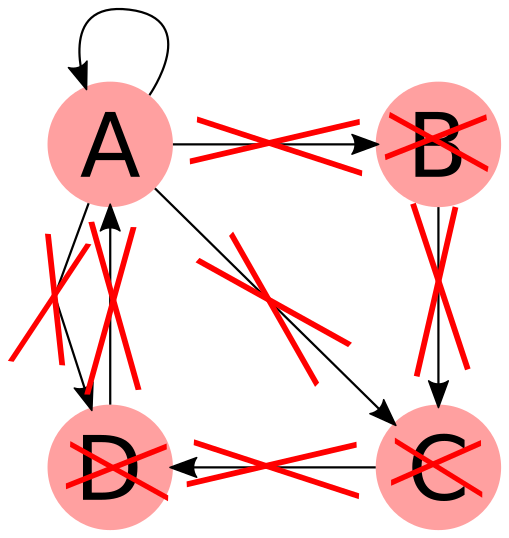

# Intro #
Author: Matt Broadway
Date: 8/11/15
Disclaimer: This is not guaranteed to be correct (but I think it is). You decide whether to believe me :)

# Exercise 2 #

Question:

"(3pts) A graph is represented as a list of pairs defining its edges. Write a function that tests whether a list of pairs represents a loop. You may assume that each edge occurs at most once in the list of edges. You may assume the list is non-empty. The behaviour of the function in these illegal cases is undefined (it can do whatever).

`loop : ('a * 'b) list -> bool`{.ocaml}"

Note: I have provided documented implementations in `wk6ex2.follow.ml`, `wk6ex2.follow.with-printing.ml`, `wk6ex2.collapse.ml`. The `with-printing` version will look more cluttered, but you can run it with examples and see what is going in in the algorithm.

# Background #
The graph is represented as a list of edges, which are _directed_! For example: `(a, b)`{.ocaml} means you can go from `a` to `b` but _not_ from `b` to `a`.

An 'outgoing neighbour' is a neighbour where there is an edge _towards_ the neighbour. Eg in the graph: `0 --> 1`, node `1` is an outgoing neighbour of `0` because there is an edge `0 --> 1` but `0` is _not_ an outgoing neighbour of `1` because there is no edge `1 --> 0`. This distinction is because the graph is directed.


# Approach #
Consider the different cases. What kinds of graphs can we have? Within each case, do you need more information to say whether the graph is a loop?

## Graph Cases ##
1. If the graph has **no edges** then I suppose it shouldn't be considered as a loop? But the question says that you can return whatever you want for this case
2. If the graph has **one edge** then under what circumstances is it a loop?
    - the example given in the question answers this: `loop [(0,0)] = true`{.ocaml}. The graph should be considered a loop _only_ if the start and end nodes of the single edge are the same
3. If the graph has **many edges** then there is more work to do. This will be discussed next.

What we have so far:

```ocaml
let loop = function
  | []             -> false  (* empty graph *)
  | [(s, e)]       -> s = e  (* single edge eg 0 --> 0 (a loop)
                                            or 0 --> 1 (not a loop) *)
  | (s, e)::_ as g -> ???    (* a graph with >1 edge *)
;;
```

## Many Edges Case ##
Here are two possible ways you could handle this case (there are almost certainly more):


## Handle Many Edges: Collapse Edges ##
This is the way that the model solutions solve the problem.

A helper function is needed to get all the _outgoing_ neighbours of a vertex **and remove the edges from the graph**.

```ocaml
(* includes duplicates, removes edges between v and its neighbours
   result is (neighbours, new_graph) *)
let rec getAndRemoveNeighbours v g = match g with
  | [] -> ([], g)
  | (s, e)::xs -> let (ns, g') = getAndRemoveNeighbours v xs in
                  if v = s then (e :: ns,          g')
                           else (     ns,  (s, e)::g')
;;
```


### Example Graph: ###

### 1 ###

### 2 ###

### 3 ###

### 4 ###


The successful base case here is when the graph contains a single edge with the start node equal to the end node. If this state is not reached then the graph is not a loop.

The success state will not be reached if if the number of neighbours is not 1 at any point during the algorithm. See my implementation (full code in `wk6ex2.collapse.ml`):

```ocaml
let rec loop = function
  | []        -> false (* empty graph *)
  | [(s, e)]  -> s = e (* single edge eg 0 --> 0 (a loop) or 0 --> 1 (not a loop) *)
  | (s, e)::g ->       (* a graph with >1 edge *)
                 let (ns_of_e, g') = getAndRemoveNeighbours e g in
                 match ns_of_e with
                   | []  -> false             (* dead end *)
                   | [x] -> loop ((s, x)::g') (* collapse s -> e -> x    to   s -> x *)
                   | _   -> false             (* more than one: fork
                                                 eg 0 --> 1 and 0 --> 2 cannot be part of a loop *)
;;
```


## Handle Many Edges: Follow the loop ##
This is the way I solved the problem.

Since the first edge has been popped off (because of the pattern matching) it is easy to use the start node of that edge as your starting point, then walk along the graph following the edges. If you reach any funny cases then the graph is not a loop.

A helper function is needed to get all the _outgoing_ neighbours of a vertex.

### Following Cases ###
how many outgoing neighbours could a node have?
- **none**: the graph is not a loop as you have reached a dead-end.
- **one**:
    - if the node has already been visited:
        - If the node is the start node _and_ all the nodes of the graph have been visited, then the graph is a loop.
        - If not, the graph is not a loop.
    - if the node has not been visited before:
        - More work is needed. Continue walking from the neighbour node.
- **many**: the graph is not a loop as it has a fork in it.

### The helper function ###

```ocaml
(* outgoing neighbours. Includes duplicates *)
let rec getNeighbours v g = match g with
  | [] -> []
  | (s, e)::xs -> let rest = getNeighbours v xs in
                  if v = s then e :: rest
                           else rest
;;
```

### The Follower Function ###
Helper functions : `setsEq a b`{.ocaml} and `getAllNodes g`{.ocaml} are required.
`setsEq` should ignore duplicates in list `a` and list `b` but make sure that there are no elements in one but not in the other.
(see my implementation of these functions in `wk6ex2.follow.ml`)


```ocaml
let rec followLoop start current visited graph =
  let ns = getNeighbours current graph in
  match ns with
    | []  -> false   (* no outgoing edges *)
    | [e] ->         (* one outgoing edge to e *)
             let visited' = e::visited in 
             if List.mem e visited (* note: not visited' but visited *)
                then (* visited before: back to start? If so, have all nodes been visited? *)
                    e = start && setsEq visited' (getAllNodes graph)
                else (* still more nodes to visit *)
                    followLoop start e visited' graph
    | _   -> false   (* fork (multiple outgoing edges) *)
;;
```

So `loop` becomes:

```ocaml
let loop = function
  | []             -> false                 (* empty graph *)
  | [(s, e)]       -> s = e                 (* single edge eg 0 --> 0 (a loop)
                                                           or 0 --> 1 (not a loop) *)
  | (s, e)::_ as g -> followLoop s s [s] g  (* a graph with >1 edge *)
;;
```
